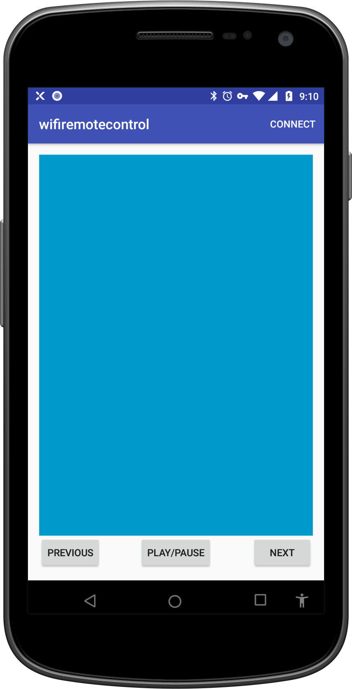
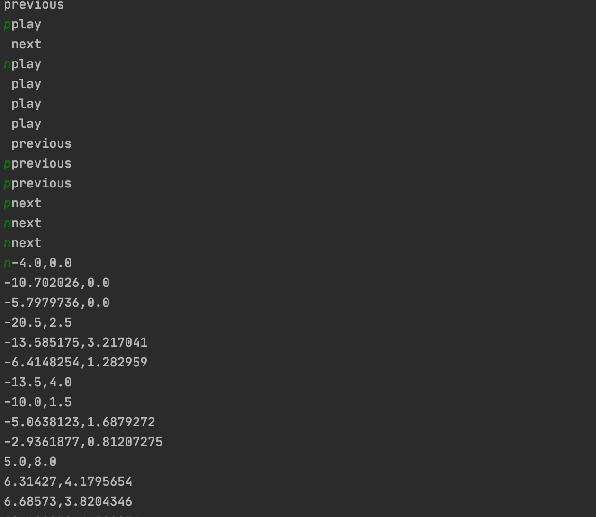

# Control PC PoC/Demo
Control your PC on bluetooth and WiFi using Android phone
#This Repo has 2 Android App(Wifi,Bluetooth) and 1 Server(Wifi,Bluetooth)

## To Run the demo
### Start the server
- Import the `server` module in Intellij IDEA
- Run `RemoteServer.java` for Wifi
- Run `RemoteBluetoothServer.java` for Bluetooth

### Connect to Server using wifi app
- Build and Run `wifiremotecontrol`
- Change `Constants.SERVER_IP` to Server IP
- Install the build in Android Device
- Tap on `CONNEC`T which is on Toolbar Menu
- Once it's connected, Now you can press buttons or move your finger(1 or 2) on blue area
- It might move cursor on Server pc. 

Device 

Server Log

